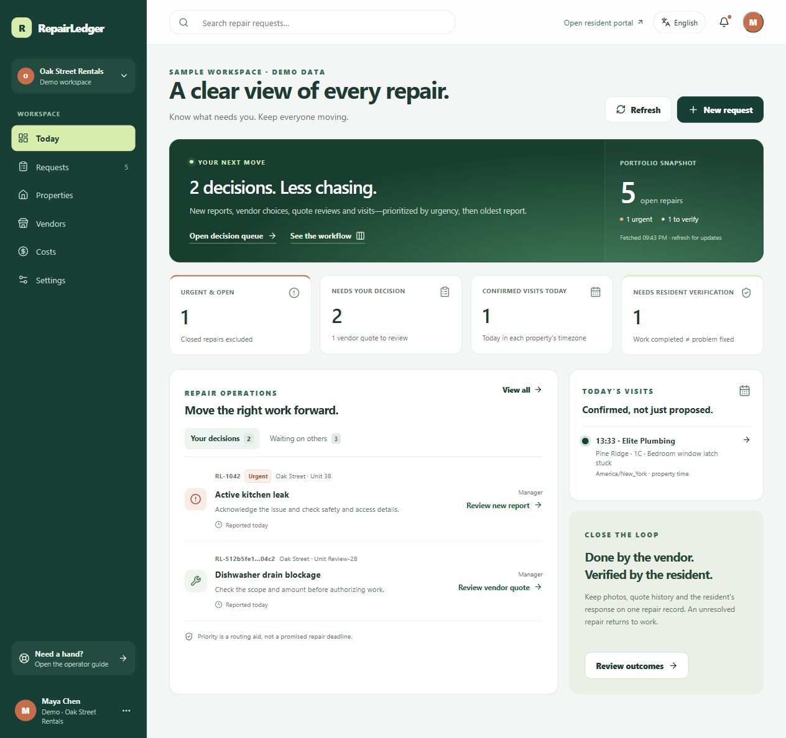
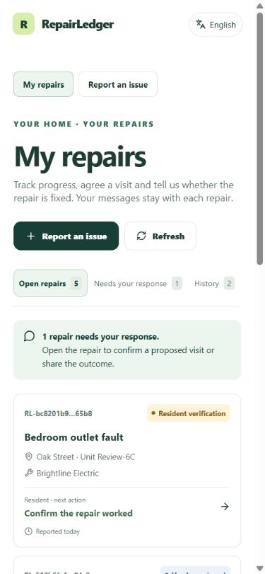

# RepairLedger: product and UI review

Reviewed and implemented on 2 October 2026 in `D:\B2B\RepairLedger-app-source`.

**Subsequent update, 3 October 2026:** the main Git checkout is now `D:\B2B\RepairLedger-Web-and-Mobile-Final\RepairLedger-app-source`. Account/occupancy-specific resident access, response allowlisting, explicit manager linking and account-scoped memory-only drafts are implemented in schema 005. See [the resident privacy and rollout guide](RESIDENT-PRIVACY.md). The review and priorities below retain their original date and are not a claim that every roadmap item has been implemented.

## Product decision

RepairLedger should be the maintenance decision desk for landlords with 5–50 units, not another broad property-management suite. The promise is: **know who acts next, what is actually agreed, and whether the resident's problem was fixed.**

This is a product recommendation based on the current source, local workflow tests, and official competitor documentation. It is not a claim that competitors lack these capabilities or that this release already outperforms them. No competitor's paid account was tested.

## Competitor evidence and its implications

| Product | What its official material describes | Implication for RepairLedger |
| --- | --- | --- |
| [Property Meld: scheduling](https://help.propertymeld.com/hc/en-us/articles/51201766579091-Understanding-Vendor-Scheduling-Options) | Vendor scheduling options consider resident presence and availability. | A visit proposal must not be presented as a confirmed booking. Make both parties' responses visible. |
| [Property Meld: insights](https://help.propertymeld.com/hc/en-us/articles/45926700631315-Actionable-Insights-Overview) | Maintenance insights cover operational areas including scheduling, communication, satisfaction and spend. | Useful metrics need real events and clear denominators, not decorative percentages. |
| [Latchel: automation](https://latchel.com/maintenance-automation/) | Maintenance workflow automation includes scheduling, reminders and follow-up. | An in-app inbox alone is not a reliable notification or escalation system. Delivery automation remains a next priority. |
| [TenantCloud: maintenance](https://www.tenantcloud.com/maintenance), [getting started](https://support.tenantcloud.com/en/articles/11897075-let-s-get-started) | Maintenance tracking includes list/board workflows, communication and recurring work. | Intake and a board are baseline features. Prioritize actionable handoffs now; add recurring prevention later. |
| [DoorLoop: work orders](https://www.doorloop.com/features/work-orders) | Tenant requests, vendor coordination, repair tracking and associated costs are part of its work-order feature set. | Compete through a focused, understandable maintenance workflow rather than copying an entire property-management suite. |
| [Buildium: maintenance tracking](https://www.buildium.com/blog/track-maintenance-requests-in-property-management-software/) | Requests can include media; work orders, vendors, recurring work and related bills/payments are addressed. | Evidence, prevention and actual expenditure matter. An approved quote is an authorization, not a paid invoice. |

The recommended differentiator is **trustworthy state plus low coordination effort**. For this customer size, one understandable next action is more valuable than an extra dashboard chart. Validate that recommendation with landlords; it is not yet a proven market advantage.

## UI references applied

- [Linear's UI redesign](https://linear.app/changelog/2024-03-20-new-linear-ui): quieter chrome, stronger hierarchy and focused work surfaces. Applied as a restrained evergreen/white palette, clear typography and a decision-first dashboard; no copied brand assets.
- [Linear Inbox](https://linear.app/docs/inbox): relevant updates should lead back to their work item. Repair notifications retain actionable links and now show readable timestamps.
- [Carbon data-table guidance](https://www.carbondesignsystem.com/building-blocks/core/components/data-table/guidelines): search, filters, sorting and pagination make operational lists usable. Added applied-filter chips, explicit search, sorting and local pagination, with cards on mobile.
- [Atlassian lozenge guidance](https://atlassian.design/components/lozenge/usage): compact, consistent status indicators. Status and urgency are separate text-labeled signals; color is not their only meaning.

## Implemented changes

### 1. Manager decision desk — `/`

The previous action preview did not reliably represent manager-owned decisions. The new dashboard separates **your decisions** from **waiting on others**, prioritizes open urgency and then oldest report, and links to the appropriate repair tab.

Metrics now distinguish open urgent repairs, manager decisions, confirmed visits today and resident verification. Closed/cancelled emergencies do not inflate open urgency. Today's visits use the appointment's timezone. Failed reads show an error rather than fabricated zero/success metrics. A fetched timestamp and manual refresh avoid a false claim of real-time subscriptions.

### 2. Operational request queue — `/requests`

- List and five-stage board: Reported → Coordinating → Visit & repair → Verify outcome → Closed.
- Open, needs-my-decision, urgent, visits/work, today's confirmed visits, verification and closed filters with consistent counts.
- Search, property/priority filters, sort options, removable filter chips and reset.
- URL-backed filters/search/sort/view so a queue can be bookmarked or shared within the authorized app.
- Draft filters only change the list when Apply is chosen; Escape/closing discards them.
- Fifteen-record client-side list pages and equivalent mobile repair cards. Backend pagination is **not** implemented.
- Each repair exposes its responsible party, next step, vendor, property/unit and age since report. Age is not an invented SLA.
- The board is intentionally read-only: open the record to perform a validated action. Dragging a card must not bypass approval or resident verification.

### 3. Repair workspace — `/requests/:id`

Added lifecycle progress, a next-owner panel and correct deep links for acknowledgment, vendor selection, quote review, visit coordination and repair history. Existing Overview, Messages, Visits, Work orders, Costs, Evidence and Audit tabs remain.

Buttons distinguish an available manager action from a handoff awaiting someone else. Closed history does not imply resident verification unless the verification record exists.

### 4. Quote review and vendor revision

Manager clarification is a named dialog with a required bounded note, rather than a browser prompt. The note enters the audit history and is displayed on the vendor revision screen. Revised scope/amounts are prefilled; the original currency is retained. Submission and approval have busy/error handling, and submitting a quote does not authorize work.

Money is formatted using each quote's currency. Approved totals group currencies separately, count only the latest authorization per repair and exclude cancelled requests. USD, INR, EUR, GBP, CAD, AUD and SGD are supported by the existing quote contract. No currency conversion, invoicing, payment or actual-spend accounting was added.

### 5. Visits

Proposal and confirmation are distinct. Shared manager/resident/vendor confirmation cards show the property timezone and each party's response. A cancelled visit never appears currently confirmed.

Manager proposal UI explains approval/vendor-acceptance prerequisites, offers duration choices and uses property-local dates. Replacing a proposal explicitly resets confirmations. Existing server guards still control writes; UI labels do not grant permissions.

### 6. Resident home and repair outcome — `/tenant`

Residents now land on **My repairs**, with Open repairs, Needs your response and History views, instead of having to find an existing repair from the reporting form. Cards open the resident status route. Portal navigation keeps My repairs and Report an issue available.

The response queue identifies an unconfirmed proposed visit or a completed repair awaiting verification. Outcome submission supports an optional bounded note. “Still happening” reopens approved work; the vendor sees the resident's follow-up note. Vendor completion returns the repair to verification, not automatic closure. “Thanks for confirming” is reserved for an actual resident verification.

This reuses the existing server-scoped requests endpoint. It does **not** solve lease-period/tenant-turnover authorization; see the pilot gate below.

### 7. Accessibility, mobile and language honesty

Dialogs/drawers have names, initial focus, Tab/Shift+Tab trapping, Escape and focus restoration. Added visible keyboard focus, a skip link, reduced-motion handling and touch-friendly equivalents. Closed mobile navigation is hidden from keyboard/accessibility traversal; mobile topbar overflow was corrected.

Language selection supports keyboard navigation and Arabic RTL navigation. Removed non-functional automatic-translation controls. The settings screen clearly states that six navigation language packs exist but workflow copy is still largely English and messages remain in their original language. This is **partial localization**, not a completed multilingual product or a WCAG certification.

## Queue policy: frontend and backend

Frontend domain/presentation helpers were extracted into `features/operations.ts`, `OperationsUI.tsx` and `money.ts`, with reusable overlay focus handling. The production build separates React/router and Supabase libraries into stable cacheable chunks using [Rollup manual chunks](https://rollupjs.org/configuration-options/#output-manualchunks). This improves cache separation; it is not a measured first-load speed claim or route-level lazy loading.

The C# `RepairAttentionHelper` and TypeScript operations helpers use equivalent manager-decision rules:

| Actual workflow condition | Responsible next action |
| --- | --- |
| New submitted/urgent report | Manager acknowledges and checks the report. |
| Acknowledged, no quote/vendor acceptance; or eligible declined offer | Manager selects/offers another vendor. |
| Pending vendor offer | Vendor responds; not a manager decision. |
| Accepted vendor, no quote or quote returned for changes | Vendor submits/revises; not a manager decision. |
| Accepted vendor, latest quote submitted | Manager reviews scope and amount. |
| Accepted vendor, approved quote, no current visit or cancelled visit | Manager proposes a visit. |
| Proposed visit | Resident/vendor confirm; not another manager proposal action. |
| Work in progress | Vendor completes approved work. |
| Verification | Resident verifies or reports the unresolved issue. |
| Legacy completed record | Manager uses Update status to publish verification; the resident is not asked for a write the API would reject. These compatibility records appear in the verification-stage list, outside the standard decision queue. |
| Closed/cancelled | History; never a manager decision. |

Unsupported/draft states are not silently counted as actionable. Queue membership is informational: business-operation authorization, state guards and revision conflict handling still decide whether a write is allowed.

## Remaining priorities, in order

| Priority | Missing capability | Acceptance condition |
| --- | --- | --- |
| Before a real pilot | Tenant-turnover privacy and role-specific payloads | Bind access to verified resident/lease identity and dates, not merely current property/unit. A replacement resident cannot see former residents' messages/evidence; internal quote/audit data follows an explicit audience policy. Test real authenticated role boundaries. |
| Before a real pilot | Production onboarding/configuration and recovery | Verify membership provisioning, least-privileged MySQL/TLS, live Supabase Auth/private Storage, backups and an actual restore exercise. No production account/database was connected in this review. |
| Next operational release | Durable email/SMS and escalation | Transactional outbox, deduplication, delivery attempts/retries, provider callbacks and failure visibility. Separate “saved in inbox” from “delivered to person.” |
| Next operational release | Real response/repair deadlines | Store acknowledgement/response/due timestamps and a timezone-aware policy; distinguish emergency instructions from routing priority. Handle after-hours and safe escalation. Do not derive deadlines from display strings. |
| Next operational release | Recurring prevention and asset repair history | Scheduled tasks create idempotent work items; appliance/system identity links repeated faults and repair-versus-replace decisions. |
| Next operational release | Invoice variance and actual spend | Link invoices to approved quote versions, flag variance, require approval and record accounting/payment status without presenting authorization as expenditure. |
| Scale and broader rollout | Pagination, localization and modular frontend | Server-scoped paging/counts, measured query performance, reviewed translation catalogs including validation/empty/error states, and route/feature modules instead of a growing central App component. |

Do not build all of these at once. Start with five landlords and the privacy/configuration gates, then measure where coordination still fails.

## Pilot success measures to instrument

These are proposed measures, not dashboard numbers already available:

- Median and upper-percentile report-to-acknowledgment time, measured from stored events.
- Time awaiting quote review, and time awaiting each visit confirmation, separated by owner.
- Resident-verified closures divided by repairs eligible for resident verification, with date window and denominator visible.
- Unresolved/reopened repairs divided by completion attempts, with repeated attempts retained.
- Quote-to-invoice variance only after an actual invoice is captured.
- Landlord coordination minutes per repair, measured in pilot interviews/time sampling.

## Verification and boundaries

Automated checks for this increment: 52 frontend operation/money tests, 92 C# regression/unit tests, five command-wrapper tests, and 32 isolated SQLite HTTP checks. TypeScript checking, Vite build and Release C# build passed. The C# tests include new queue and timezone cases; a passing local run is not a production MySQL connection test. Earlier MySQL migration/workflow results remain documented in [backend verification](BACKEND-VERIFICATION.md).

Browser checks used a separate synthetic SQLite review database, never `apps/api/repairledger.local.db`. Verified: filter cancel/apply/reset, board deep links, quote clarification/revision/approval, visit proposal labeling, resident unresolved → vendor follow-up → resident-verified closure, portal navigation, mobile cards, notification access, focus restoration/trapping and Arabic RTL navigation. Manager/resident queue layouts were checked at 390px and 320px without document-level horizontal overflow after the fix.

The full authenticated frontend was compiled using clearly non-real build placeholders, then the normal unconfigured build was restored. Its app/framework/auth chunks were approximately 151/182/227 kB respectively, rather than one 561 kB chunk. The built unconfigured preview correctly displayed the authentication setup gate with no observed console errors; no sign-in to a real Supabase project was tested. Temporary API, development and preview servers were stopped after checks.

No user MySQL data, private credential file, Supabase deployment or existing SQLite data was migrated. The application remains C# / Dapper / **MySQL 8.4** by default; SQLite was explicit for these isolated tests only. No schema changes were needed for this UI/queue increment. Full translations, delivered reminders, SLA automation and invoice/payment processing remain unimplemented.

Run from the repository root using the configured Node 22+/.NET 10 runtimes (Node 24 was used for verification):

```powershell
npm run typecheck
npm run build
npm run test:web
npm run test:scripts
.\.tools\dotnet\dotnet.exe test tests/RepairLedger.Api.Tests/RepairLedger.Api.Tests.csproj -c Release
pwsh -File scripts/test-api.ps1
```

For actual startup, follow [setup](SETUP.md), configure your MySQL connection and Supabase keys, and run `npm run db:check` before `npm run dev`. Do not deploy the test database or enable demo mode for real residents.

## Actual UI screenshots

These are browser captures of the implemented React screens using synthetic fixtures, not generated design mockups. Counts differ between captures because the test workflow changed records.

- [Manager decision dashboard](ui-review/dashboard-desktop.jpg)
- [Five-stage workflow board](ui-review/workflow-board-desktop.jpg)
- [Manager quote review](ui-review/quote-review-desktop.jpg)
- [Vendor quote revision and manager note](ui-review/vendor-quote-revision-desktop.jpg)
- [Visit proposal and confirmation](ui-review/visit-proposal-desktop.jpg)
- [Mobile manager requests](ui-review/requests-mobile.jpg)
- [Mobile resident My repairs](ui-review/resident-home-mobile.jpg)
- [Mobile resident outcome verification](ui-review/resident-verification-mobile.jpg)




